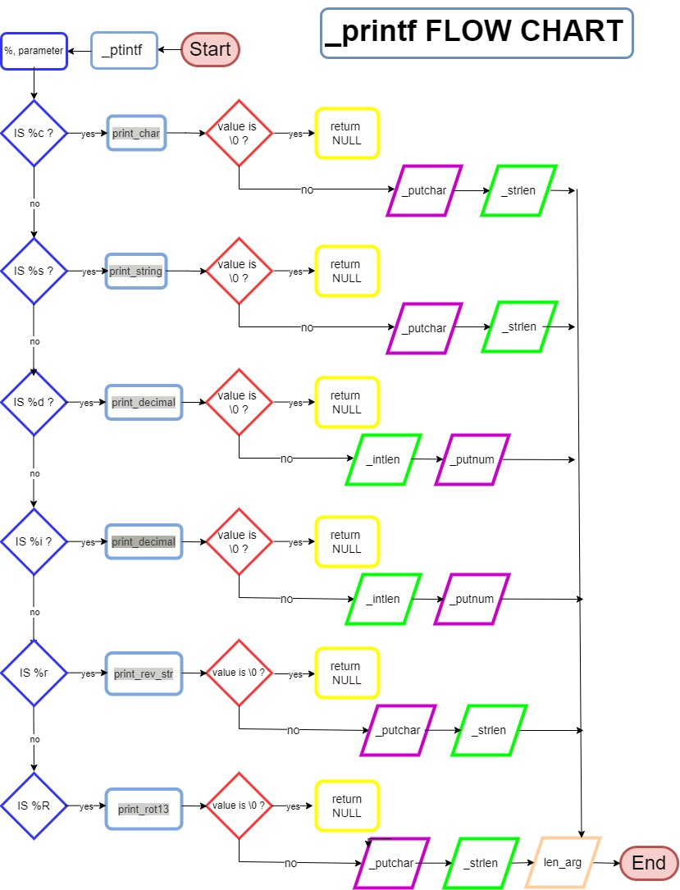

# _printf 👋
```_printf``` is a custom implementation of the C programming function ```printf```. This project is an application of the C programming knowledge that [Holberton School](https://www.holbertonschool.com/) cohort 17 students have learned.

**Prototype:** 

> int _printf(const char *format, ...);

## Examples

**String**
* Input: ```_printf("%s\n", 'Hello world!');```
* Output: ```Hello world!```

**Character**
* Input: ```_printf("The first letter in "Hello world!" is %c\n", 'H');```
* Output: ```The first letter in "Hello world" is H```

**Integer**
* Input: ```_printf("There are %i minutes in an hour\n", 60);```
* Output: ```There are 60 minutes in an hour```

**Decimal:**
* Input: ```_printf("%d\n", 1000);```
* Output:  ```1000```

## How this work:

If you want to read a short manual, to search specific commands, how they works, flags, accepted parameters, qualities, and other topics, please refer to this manual man_3_printf!

Just type in the console:
> man - l man_3_printf

This man page comes thanks to the pandoc program.

## Project Requirements

### General

* All files will be compiled on Ubuntu 20.04 LTS
* Your code should use the Betty style. It will be checked using [betty-style.pl](https://github.com/holbertonschool/Betty/blob/master/betty-style.pl) and [betty-doc.pl](https://github.com/holbertonschool/Betty/blob/master/betty-doc.pl)
* Global variables are not allowed

### Authorized functions and macros:

  * ```write``` (man 2 write)
  * ```malloc``` (man 3 malloc)
  * ```free``` (man 3 free)
  * ```va_start``` (man 3 va_start)
  * ```va_end``` (man 3 va_end)
  * ```va_copy``` (man 3 va_copy)
  * ```va_arg``` (man 3 va_arg)

## Functions:

- [x] Type char
- [x] Type string
- [x] Type percent
- [x] Type decimal, base 10
- [x] Type integer, base 10
- [ ] Type binary
- [ ] Type unsigned decimal, base 10
- [ ] Type octal
- [ ] Type hexadecimal, base 16
- [ ] Type reverse string
- [ ] Type Rot13

### Compilation

> gcc -Wall -Werror -Wextra -pedantic -std=gnu89 *.c

## Mandatory Tasks

- [x] Write function that produces output with conversion specifiers ```c```, ```s```, and ```%``` and **Returns** the number of characters printed (excluding the null byte used to end output to strings).
- [x] Handle conversion specifiers ```d```, ```i```.
- [x] Create a man page for your function.

## Advanced Tasks
**PENDIENTE**

## Table of functions, symbols and description:

| Function  | Symbol  | Description |
| :------ |:--------------:| ---------------------:|
| `printf_s`      | %s | Prints a string |
| `printf_c`      | %c  |   Prints a character |
| `printf_d`   | %d   |   Prints in decimal format |
| `printf_i`      |%i  |   Prints a integer |
| `printf_per`      | %per |   Prints in percentage format |
| `printf_R`     | %R |   Prints in ROT13 format |
| `printf_r`     | %r |   Prints a string in reverse |


## FlowChart




## Authors
<a href = 'https://www.github.com/Crisgrva'> </a> [@carlosberrio](https://github.com/carlosberrio) | [@santiagobedoa](https://github.com/santiagobedoa)

<a href = 'https://www.twitter.com/crisgrvc'> </a> [@Carlosberro6](https://twitter.com/carlosberro6) | [@santiagobedoa](https://twitter.com/santiagobedoa)
